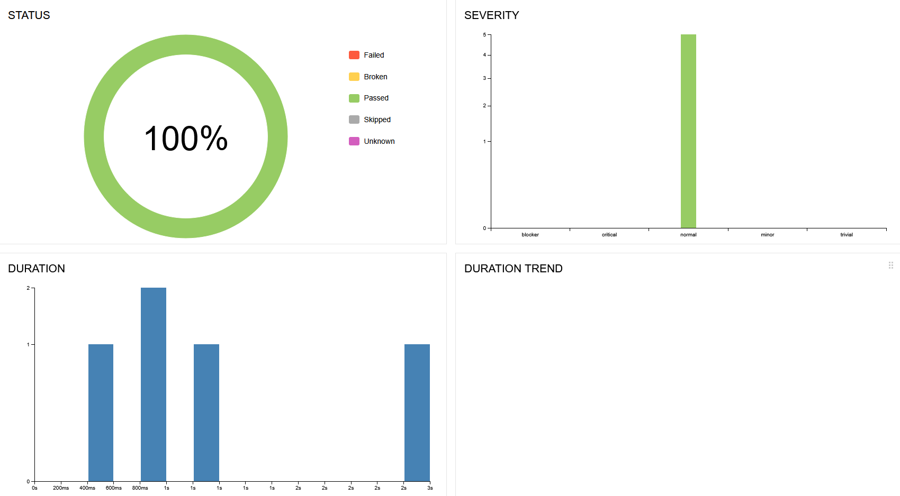

[](https://github.com/LauraFSantiago/cypress-ecommerce-portfolio/actions/workflows/main.yml)

# 🛒 Swag Labs Automation - Cypress E2E

Este projeto consiste em uma suíte de testes automatizados End-to-End (E2E) para a plataforma de e-commerce **Swag Labs**, focado em garantir a qualidade do fluxo crítico de vendas (Login, Carrinho e Checkout).

## 🚀 Tecnologias Utilizadas

- **Cypress** (Framework de Testes)
- **JavaScript**
- **Page Object Model (POM)** (Arquitetura para organização e manutenção)
- **Node.js**

## 📂 Estrutura do Projeto

O projeto utiliza o padrão **Page Objects** para separar a lógica dos testes dos elementos da página:

- `cypress/e2e/`: Contém os arquivos de teste (`login.cy.js`, `compras.cy.js`, `checkout.cy.js`).
- `cypress/support/pages/`: Contém as classes das páginas e seus métodos (`login.page.js`, `inventory.page.js`, `checkout.page.js`).

## 📊 Relatório de Testes (Visual)

Abaixo, o painel do Allure Report comprovando a execução de 100% dos testes (UI + API + BDD) com sucesso.



## 🧪 Cenários Automatizados

### 1. Login

- ✅ Login com sucesso (usuário padrão).
- ✅ Validação de erro com credenciais inválidas.

### 2. Fluxo de Compras

- ✅ Adicionar múltiplos produtos ao carrinho.
- ✅ Validar contador do carrinho.
- ✅ Remover itens do carrinho.

### 3. Checkout (Pagamento)

- ✅ Preenchimento de formulário de entrega.
- ✅ Finalização de compra com sucesso ("Thank you for your order!").
- ✅ Validação de campos obrigatórios (Mensagens de erro).

### 4. API Testing (Back-end)

- ✅ Validação de status code (200 OK, 201 Created).
- ✅ Validação de contrato (Campos do JSON).
- ✅ Testes de performance (Tempo de resposta da API).
- ✅ Massa de dados dinâmica (Gerador de e-mail aleatório para evitar conflitos).

### 5. BDD (Behavior Driven Development) 🥒

- ✅ Integração com **Cucumber**.
- ✅ Escrita de cenários em **Gherkin** (PT-BR).
- ✅ Reutilização de Steps para escalabilidade.
- ✅ Data Driven Testing: Validação de múltiplos cenários de login (bloqueado, senha errada, vazio) usando tabelas de exemplos.

## ⚙️ Como rodar o projeto

1. Clone o repositório:

   ```bash
   git clone https://github.com/LauraFSantiago/cypress-ecommerce-portfolio.git

   ```

2. Instale as dependências:

   ```bash
   npm install

   ```

3. Abra o Cypress:
   ```bash
   npx cypress open
   ```
